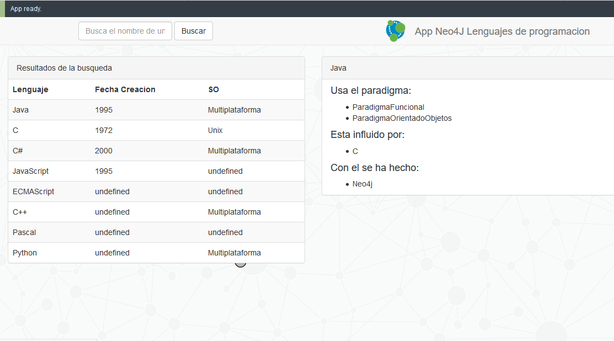

# Neo4j Lenguajes de programación - Aplicación de ejemplo



## GIST
* Hay un GIST sobre este proyecto que puedes ver en [https://portal.graphgist.org/graph_gists/lenguajes_de_programacion](https://portal.graphgist.org/graph_gists/lenguajes_de_programacion)

## Instrucciones

### Instalar dependencias

```bash
# Se necesita tener instalado NodeJS
$ npm install
```

### Ejecutar localmente en modo dev

* Ejecutar Neo4J ([Descargar e Instalar](http://neo4j.com/download)) localmente (/bin neo4J console)
* y abrir el Neo4J Browser [Neo4j Browser](http://localhost:7474). 
* Ir a la carpeta del proyecto y ejecutar en línea de comandos:

```bash
# Ejecutar en modo desarrollo, los cambios se actualizan automáticamente
$ npm run dev

# Para construir la aplicación en la carpeta build
$ npm run build
```

Cuando se esté ejecutando en modo dev, ir a la dirección [http://localhost:8080/webpack-dev-server/](http://localhost:8080/webpack-dev-server/) para ver la app.

Después de ejecutar el comando `npm run build`,  abrir el archivo "build/index.html" en el navegador.

### Ejecutar localmente

# Abrir en http://localhost:8080
$ npm run start
```
